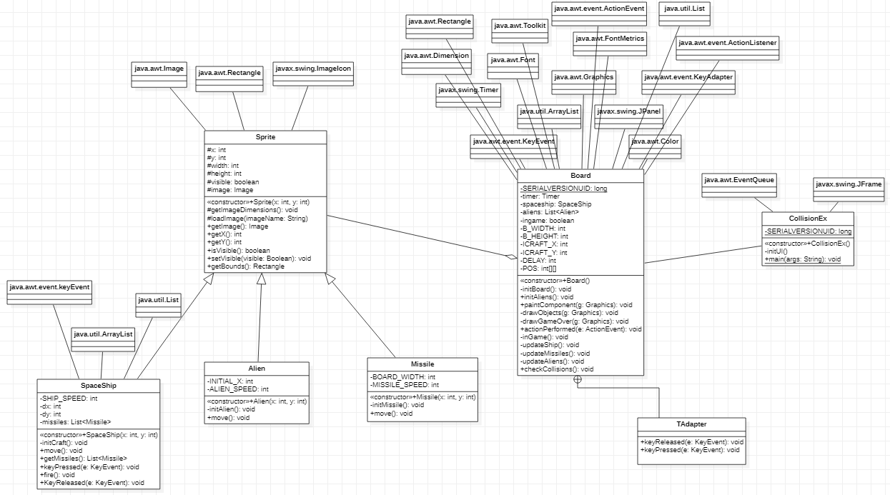
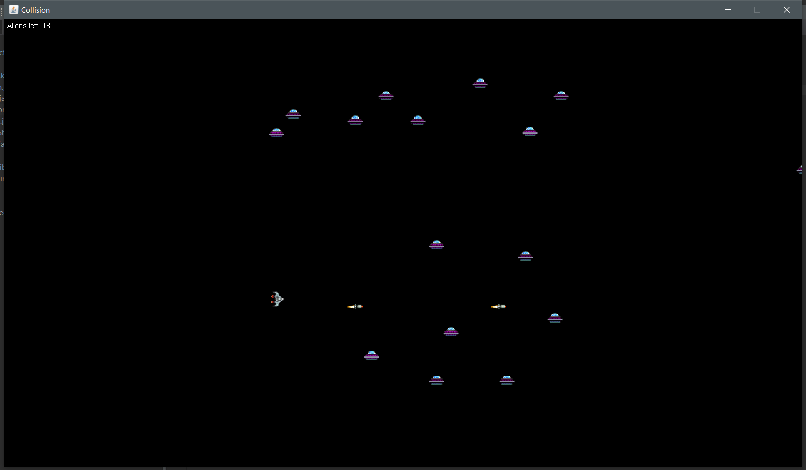

# Collision Detection 

### link : http://zetcode.com/javagames/collision/

### Description
Project ini merupakan project untuk membuat permainan sederhana dengan Java. Permainan yang dibuat berupa game tembak-menembak dua dimensi.

Pada project ini dibuat beberapa kelas
1. Sprite.java
    - sebagai kelas parent untuk beberapa objek yang ada dalam game
2. Spaceship.java (diturunkan dari Sprite.java) 
    - merepresentasikan objek kendaraan luar angkasa yang akan dikendalikan oleh user untuk menghabisi alien
3. Alien.java (diturunkan dari Sprite.java) 
    - merepresentasikan objek alien yang muncul secara acak dan akan menjadi target tembak user
4. Missile.java (diturunkan dari Sprite.java) 
    - merepresentasikan objek peluru yang digunakan Spaceship untuk menembak Alien.
5. Board.java 
    - merepresentasikan papan permainan dan semua objek yang ada dalam papan.
6. CollisionEx.java
    - berisi fungsi main dan inisialisasi papan permainan

### Class Diagram Image

  

### Running Program Image

  

