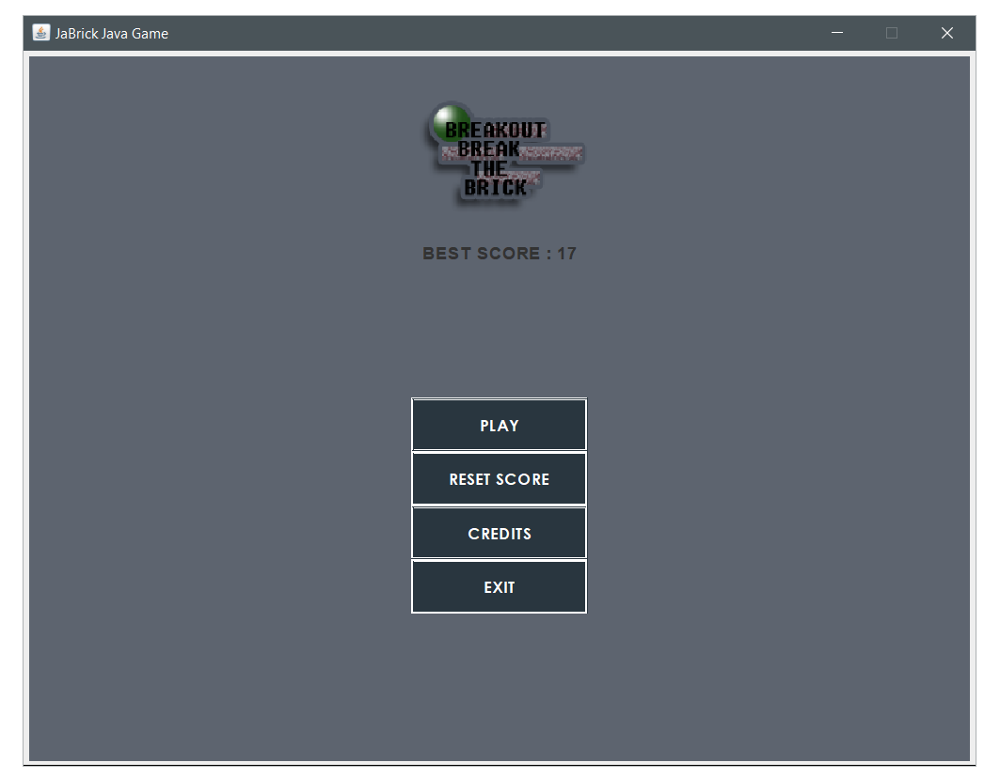
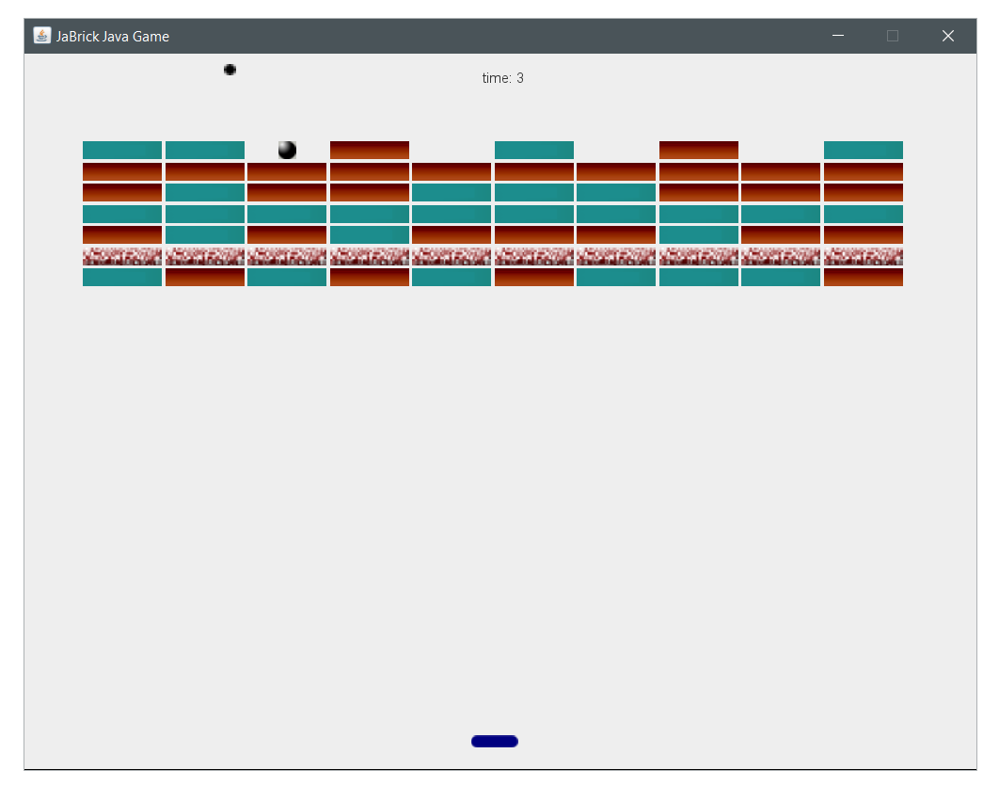
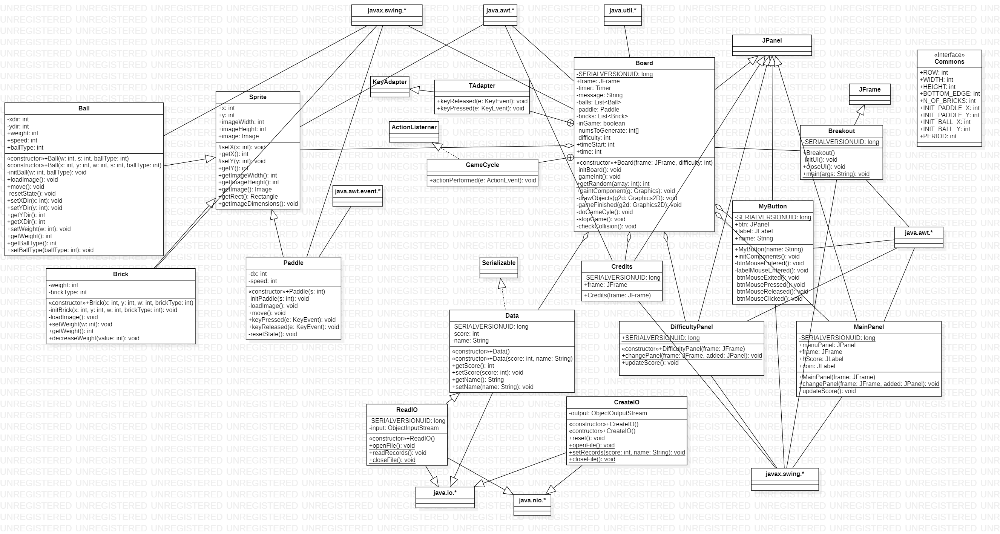

# JaBrick - Break The Brick [Java Simple GUI Game]

  
  

JaBrick adalah game GUI sederhana berbasis bahasa Java yang mengimplementasikan Pemrograman Berbasis Objek atau OOP. Game ini dibuat dengan ide referensi dari <a href="http://zetcode.com/javagames/breakout/">ZeetCode</a> yang dimodifikasi sedemikian sehingga lebih interaktif dan menarik. Inti dari game ini yakni disediakan beberapa balok, satu bola, dan satu pedal, dimana pemain diharuskan bertahan selama mungkin dan menghancurkan balok balok yang tersedia dengan bola yang dapat dipantulkan pada pedal, sehingga menghindari bola keluar area permainan. 
 

### Struktur Program

### Fitur
- Main Menu Page
  - Judul Game (JLabel with image)
  - Best Score (JLabel)
  - PLAY Button (JPanel)
    - EASY Button [memainkan game dengan level paling mudah]
    - MEDIUM Button [memainkan game dengan level sedang]
    - HARD Button [memainkan game dengan level paling sulit]
  - RESET SCORE Button (JPanel)
  - CREDITS Button (JPanel)
  - EXIT Button (JPanel)
  
### Class Diagram

  

### Video Permainan

### License
Available under 2-Clause BSD License https://opensource.org/licenses/BSD-2-Clause
