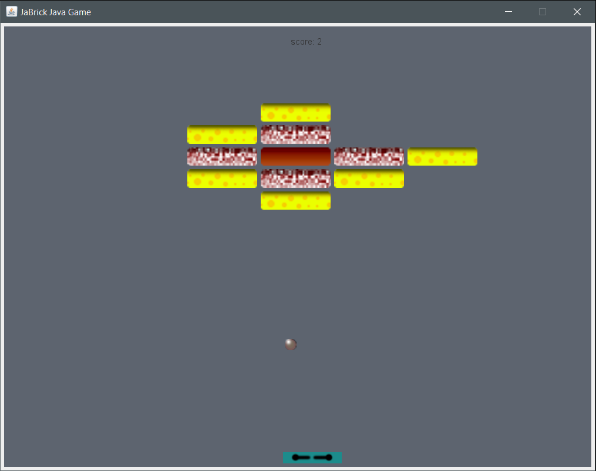

# JaBrick - Break The Brick [Java Simple GUI Game] as Final Project of PBO Class 2020

  

## Judul : JaBrick - Break The Brick
## Jenis : Permainan 

## Anggota Kelompok
Nama : Mohammad Faderik Izzul Haq (05111940000023)  
username : alitelboi

Nama: Dias Tri Kurniasari (05111940000035)  
username: DisDias

Nama : Iwan Dwi Prakoso (05111940000229)  
username : iwandepe

## Deskripsi Aplikasi
Dalam rangka berakhirnya proses pembelajaran matakuliah Pemrograman Berorientasi Objek Semester 3 ini, sebagai tugas akhir atau Final Project, kami <a href="https://github.com/iwandepe/Tugas-Kelompok-PBO/">Kelompok XYZ</a> dari Kelas PBO-E merealisasikannya dalam bentuk Game JaBrick ini. JaBrick adalah game GUI sederhana berbasis bahasa Java yang mengimplementasikan Pemrograman Berbasis Objek atau OOP. Game ini dibuat dengan ide referensi dari ZetCode yang dimodifikasi sedemikian sehingga lebih interaktif dan menarik. Inti dari game ini yakni disediakan beberapa balok, satu bola, dan satu pedal, dimana pemain diharuskan bertahan selama mungkin dan menghancurkan seluruh balok-balok yang tersedia dengan bola yang dapat dipantulkan pada pedal, sehingga menghindari bola keluar dari area permainan yang akan membuat pemain kalah. Pemain dapat memenangkan permainaan jika balok yang tersedia telah habis dihancurkan.

## Class Diagram 

## Struktur Program
Penjelasan masing-masing kelas yang digunakan dibagi menjadi beberapa package sebagai berikut :

### Controller
[`Controller.java`](src/id/ac/its/kelompokxyz/controller/Controller.java)
Kelas ini merupakan kelas inti dari program dimana fungsi main berada. Kelas ini berfungsi mengatur seluruh jalannya program dengan menjalankan program yang ada pada kelas model dan mengatur panel yang harus ditampilkan pada game sesuai game status. Selain itu, key listener pada saat permainan diatur dalam kelas ini.

### Model
[`Model`](src/id/ac/its/kelompokxyz/model)
Package ini merupakan package yang mengorganisasi seluruh data yang dibutuhkan dalam game. Dalam package ini berisi class utama yaitu [`Model.java`](src/id/ac/its/kelompokxyz/model) yang mengorganisasi pemrosesan data. Dalam package ini juga ada kelas-kelas yang merepresentasikan objek dalam game seperti [`Ball`](src/id/ac/its/kelompokxyz/model/Ball.java), [`Brick`](src/id/ac/its/kelompokxyz/model/Brick.java), dan [`Paddle.java`](src/id/ac/its/kelompokxyz/model).

### Sound
[`Sound`](src/id/ac/its/kelompokxyz/sound)
Package ini berisi backsound yang akan berjalan ketika game mulai dimainkan.

### Util
[`Util`](src/id/ac/its/kelompokxyz/util)
Package ini berisi sebuah interface [`Commons`](src/id/ac/its/kelompokxyz/util/Commons.java) yang berisi nilai-nilai inisialisasi ukuran frame, posisi bola, dan lain-lain. Selain itu package ini juga berisi [`GameState`](src/id/ac/its/kelompokxyz/util/GameState.java) yaitu sebuah kelas enum yang menunjukkan halaman apakah yang sedang aktif dalam game.

### View
[`View`](src/id/ac/its/kelompokxyz/view)
Package ini berisi semua kelas yang berfungsi untuk menampilkan gambar ke layar. Package ini memiliki kelas utama yaitu [`View.java`](src/id/ac/its/kelompokxyz/view/View.java), kelas ini mengatur panel-panel yang akan ditampilkan ke layar sesuai dengan kelas yang dipanggil dari Model.

### Resource
Berisi gambar-gambar yang dibutuhkan pada game.

## Fitur Permainan
Berikut ini merupakan beberapa objek atau komponen permainan yang ada dalam proyek ini :

### Paddle
Paddle merupakan objek game yang digunakan untuk mencegah bola keluar dari area permainan. Paddle dapat dikendalikan oleh pemain menggunakan keyboard arah kanan dan kiri. Pemain harus menggerakkan Paddle sesuai posisi bola untuk memantulkannya kembali ke atas, sehingga bola tidak keluar dari area permainan.

### Brick
Brick merupakan objek game yang harus dihancurkan oleh pemain menggunakan bola yang dipantul-pantulkan menggunakan Paddle. Pemain harus menghancurkan seluruh Brick untuk memenangkan permainan. Brick memiliki beberapa tipe dan masing-masing memiliki berat yang berbeda, sehingga mungkin perlu beberapa kali tabrakan untuk menghancurkan Brick tersebut.

### Ball
Ball merupakan objek game yang dapat menghancurkan Brick. Ball dapat memantul sesuai letak pemantulan pada Padlle. Bola memiliki berat sehingga dapat menghancurkan Brick sesuai berat Brick nya.

### Prize
Prize merupakan objek game yang dapat terlihat pemain jika menghancurkan beberapa Brick tertentu. Prize terlatak pada posisi yang acak sehingga pemain tidak dapat menebak posisi tersebut. Terdapat dua tipe Prize dalam game ini. Pertama, ManyBall yakni bola banyak, jika Ball dapat menabrak Prize ini maka bola akan menjadi banyak dan dapat mempercepat proses penghancuran seluruh Brick. Kedua, BigBall yakni bola berat, jika Ball dapat menabrak Prize ini maka bola akan menjadi lebih berat dan dapat menghancurkan Brick berat dengan lebih cepat.

### Sound
Sound disini merupakan unsur tambahan dalam permainan sehingga game lebih menarik dan interaktif.

### High Score
High Score merupakan fitur dalam game yang menyimpan skor pemain berdasar jumlah Brick yang berhasil dihancurkan pada tiap permainan. High Score disimpan dalam bentuk objek class Data dalam file [`client.ser`]. High Score ditampilkan pada MenuPanel dan GameOverPanel ketika pemain selesai bermain. Pemain juga dapat mereset score kembali menjadi nol jika mengingikan hal tersebut dengan mengklik tombol RESET SCORE.

### Menu Panel

  

Menampilkan halaman yang akan muncul pertama kali saat program dijalankan. Berisi pilihan PLAY, RESET SCORE, CREDITS, DAN EXIT.

### Level Panel

  

Ketika pada Menu Panel player memilih PLAY maka player akan diarahkan ke Level Panel untuk memilih kesulitan dalam bermain. Tingkat kesulitan disini akan memengaruhi kecepatan bola dalam bergerak.

### Map Panel

  

Setelah user memilih tingkat kesulitan game, selanjutnya player dapat memilih susunan brick yang akan dimainkan, akan ada 3 pilihan sususan brick.

### Credit Panel

  

Credit panel berisi informasi mengenai game yang sedang berjalan dan pembuat game serta referensi yang digunakan.

### Game Play Panel

  

Game Play Panel adalah panel dimana user akan bermain.

### Game Over Panel

  

Ketika player telah menghancurkan semua brick yang ada, atau telah kehabisan bola maka akan diarahkan ke Game Over Panel untuk mendapatkan keterangan Kalah atau Menang.

## Referensi
<a href="http://zetcode.com/javagames/breakout/">ZetCode</a> : Struktur mekanik permainan  
<a href="https://github.com/jbberinger/Snake">Jbbreinger</a> : Struktur kode dan arsitektur program MVC  
<a href="https://github.com/iwandepe/Tugas-Kelompok-PBO">Kelompok XYZ</a> : Dokumentasi lainnya dari Oracle dan penugasan harian  
