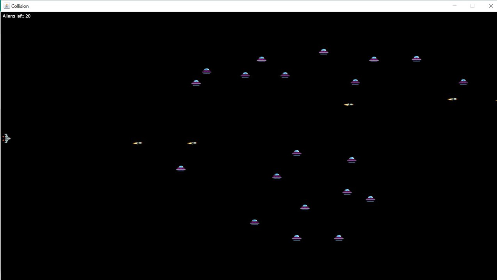

# Modification of Collision Detection 

### link : http://zetcode.com/javagames/collision/

### Description
Project ini merupakan project untuk membuat permainan sederhana dengan Java. Permainan yang dibuat berupa game tembak-menembak dua dimensi. dengan pedoman pada projek sebelumnya, kini pesawat (player) dapat dikendalikan menggunakan gerakan mouse dengan implementasi mouse Handling

Pada project ini dibuat beberapa kelas
1. Sprite.java
    - sebagai kelas parent untuk beberapa objek yang ada dalam game
2. Spaceship.java (diturunkan dari Sprite.java) 
    - merepresentasikan objek kendaraan luar angkasa yang akan dikendalikan oleh user untuk menghabisi alien
3. Alien.java (diturunkan dari Sprite.java) 
    - merepresentasikan objek alien yang muncul secara acak dan akan menjadi target tembak user
4. Missile.java (diturunkan dari Sprite.java) 
    - merepresentasikan objek peluru yang digunakan Spaceship untuk menembak Alien.
5. Board.java 
    - merepresentasikan papan permainan dan semua objek yang ada dalam papan.
6. CollisionEx.java
    - berisi fungsi main dan inisialisasi papan permainan

Perubahan yang dilakukan terhadap projek sebelumnya
1. Board.java
    - pada class ini ditambahkan fungsi addMouseMotionListener dengan argumen class TAdapter yang meng override fungsi2 Handling
    - pada class TAdapter yang berada dalam class Board ini ditambah beberapa implementasi dari MouseListener dan MouseMovedListener
    - pada class TAdapter yang sebelumnya mengoveride fungsi keyRealesed dihilangkan, selain itu ditambahkan definisi Override baru yakni fungsi mouseMoved untuk mempasing mouseEvent ke fungsi pergerakan player di class Spaceship dan fungsi mouseClicked untuk mempasing mouseEvent ke fungsi fire() di class Spaceship.

2. Spaceship.java
    - 

### Class Diagram Image

  

### Running Program Image

  

### Link Video of Running Program
1. Keyboard Handling
    https://youtu.be/l6K-qijLx94
2. Mouse Handling
    https://youtu.be/Mf5dCJI7puA
